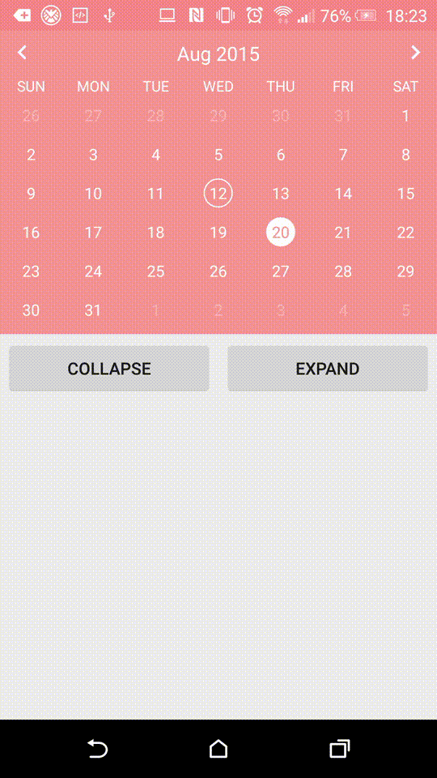

Android Flexible Calendar
=========================

Flexible Calendar is a pretty light and simple calendar library. Developers can add a basic calendar with a custom style and attributes to their app easily.

The most special feature is that you can toggle the calendar between collapsed or expanded state with smooth animation, therefore developer can use the space of screen more efficiently.


Demo
-------


Usage
-----

###View

First, set a namespace like "custom" in your root view.

```xml
<LinearLayout
    xmlns:android="http://schemas.android.com/apk/res/android"
    xmlns:custom="http://schemas.android.com/apk/res-auto"
    ...
```

Second, add a view of FlexibleCalendar into your layout, and the work has almost done.

```xml
<com.azurechen.fcalendar.widget.FlexibleCalendar
    android:id="@+id/calendar"
    android:layout_width="match_parent"
    android:layout_height="wrap_content"
    custom:style="pink" />
```

Finally, set the adapter of calendar, and you can bind events and call some methods later.

```java
FlexibleCalendar viewCalendar = (FlexibleCalendar) findViewById(R.id.calendar);
Calendar cal = Calendar.getInstance();
CalendarAdapter adapter = new CalendarAdapter(this, cal);
viewCalendar.setAdapter(adapter);
```

###Themes

There are five default themes with different colors, but you are definitely able to set attributes like colors by yourself.

###Attributes

The following is some attributes:

```xml
<declare-styleable name="UICalendar">

	<!-- light, pink, orange, blue, green -->
    <attr name="style" format="enum" />
    <attr name="showWeek" format="boolean" />
    <!-- sunday, monday, tuesday, wednesday, thursday, friday, saturday -->
    <attr name="firstDayOfWeek" format="enum" />
    <!-- expanded, collapsed -->
    <attr name="state" format="enum" />

    <attr name="textColor" format="color" />
    <attr name="primaryColor" format="color" />

    <attr name="todayItem_textColor" format="color" />
    <attr name="todayItem_background" format="integer" />
    <attr name="selectedItem_textColor" format="color" />
    <attr name="selectedItem_background" format="integer" />

    <attr name="buttonLeft_drawable" format="integer" />
    <attr name="buttonRight_drawable" format="integer" />

    <attr name="defaultSelectedItem" format="string" />

</declare-styleable>
```
And this is a sample about all attributes you can set:

```xml
<com.azurechen.fcalendar.widget.FlexibleCalendar
    android:layout_width="match_parent"
    android:layout_height="wrap_content"
    custom:style="pink"
    custom:showWeek="true"
    custom:firstDayOfWeek="sunday"
    custom:state="expanded"
    custom:textColor="@android:color/white"
    custom:primaryColor="@android:color/holo_red_light"
    custom:todayItem_textColor="@android:color/black"
    custom:todayItem_background="@drawable/today_item_background"
    custom:selectedItem_textColor="@android:color/black"
    custom:selectedItem_background="@drawable/selected_item_background"
    custom:buttonLeft_drawable="@drawable/ic_arrow_left"
    custom:buttonRight_drawable="@drawable/ic_arrow_right" />
```

###Methods

```java
// UI getters and setters
int       getStyle()
void      setStyle(int style)
boolean   isShowWeek()
void      setShowWeek(boolean showWeek)
int       getFirstDayOfWeek()
void      setFirstDayOfWeek(int firstDayOfWeek)
int       getState()
void      setState(int state)
int       getTextColor()
void      setTextColor(int textColor)
int       getPrimaryColor()
void      setPrimaryColor(int primaryColor)
int       getTodayItemTextColor()
void      setTodayItemTextColor(int todayItemTextColor)
Drawable  getTodayItemBackgroundDrawable()
void      setTodayItemBackgroundDrawable(Drawable todayItemBackgroundDrawable)
int       getSelectedItemTextColor()
void      setSelectedItemTextColor(int selectedItemTextColor)
Drawable  getSelectedItemBackgroundDrawable()
void      setSelectedItemBackgroundDrawable(Drawable selectedItemBackground)
Drawable  getButtonLeftDrawable()
void      setButtonLeftDrawable(Drawable buttonLeftDrawable)
Drawable  getButtonRightDrawable()
void      setButtonRightDrawable(Drawable buttonRightDrawable)
//Day     getSelectedItem()
//void    setSelectedItem(Day selectedItem)

// Calendar control methods
void      setAdapter(CalendarAdapter adapter)
void      addEventTag(int numYear, int numMonth, int numDay)
void      prevMonth()
void      nextMonth()
void      prevWeek()
void      nextWeek()
int       getYear()
int       getMonth()
Day       getSelectedDay()
boolean   isSelectedDay(Day day)
boolean   isToady(Day day)
int       getSelectedItemPosition()
int       getTodayItemPosition()
void      collapse(int duration)
void      expand(int duration)
void      select(Day day)
void      setStateWithUpdateUI(int state)
void      setCalendarListener(CalendarListener listener)
```

###Events

There are some events will be triggered on specific state:

```java
// triggered when a day is selected programmatically or clicked by user.
void onDaySelect();

// triggered only when the views of day on calendar are clicked by user.
void onItemClick(View v);

// triggered when the data of calendar are updated by changing month or adding events.
void onDataUpdate();

// triggered when the month are changed.
void onMonthChange();

// triggered when the week position are changed.
void onWeekChange(int position);
```

In order to listen these events, you should register a CalendarListener first, like the following example:

```java
viewCalendar.setCalendarListener(new FlexibleCalendar.CalendarListener() {
    @Override
    public void onDaySelect() {
        Day day = viewCalendar.getSelectedDay();
        Log.i(getClass().getName(), "Selected Day: "
                + day.getYear() + "/" + (day.getMonth() + 1) + "/" + day.getDay());
    }

    @Override
    public void onItemClick(View v) {
        Day day = viewCalendar.getSelectedDay();
        Log.i(getClass().getName(), "The Day of Clicked View: "
                + day.getYear() + "/" + (day.getMonth() + 1) + "/" + day.getDay());
    }

    @Override
    public void onDataUpdate() {
        Log.i(getClass().getName(), "Data Updated");
    }

    @Override
    public void onMonthChange() {
        Log.i(getClass().getName(), "Month Changed"
                + ". Current Year: " + viewCalendar.getYear()
                + ", Current Month: " + (viewCalendar.getMonth() + 1));
    }

    @Override
    public void onWeekChange(int position) {
        Log.i(getClass().getName(), "Week Changed"
                + ". Current Year: " + viewCalendar.getYear()
                + ", Current Month: " + (viewCalendar.getMonth() + 1)
                + ", Current Week position of Month: " + position);
    }
});
```